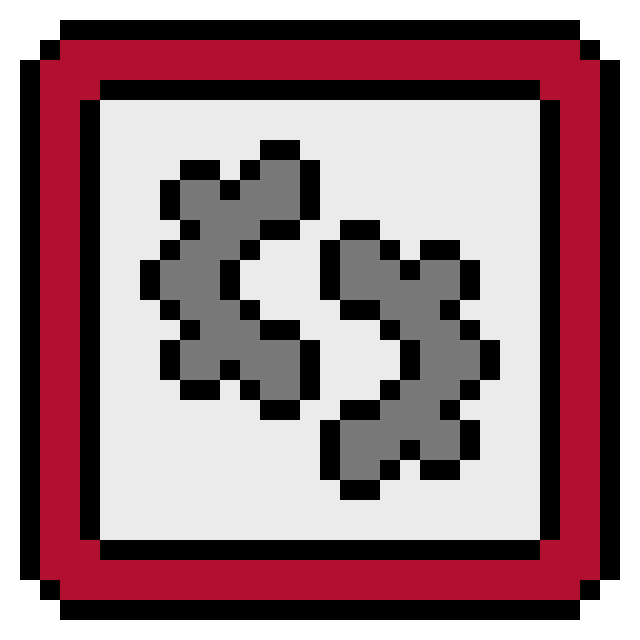

  

# Indie Game Components

A collection of high-quality, professional, and reusable components for Godot 4.6. Designed to jumpstart your indie game development with robust, modular logic.

---

## Included Components

### Vitals System
*Located in `addons/indie_game_components/components/vitals/`*

| Component | Description | Key Features |
| :--- | :--- | :--- |
| **HealthComponent** | Manage entity health and life cycles. | I-frames, immortality toggle, damage/healing signals. |
| **ManaComponent** | Manage magical resources or stamina. | Passive regeneration, post-spend regen delay, spending logic. |

### Movement System
*Located in `addons/indie_game_components/components/movement/`*

#### Grid-Based (Tactical/Retro)
| Component | Description |
| :--- | :--- |
| **GridMoverComponent** | Precise tile-to-tile movement with smooth tweens. |
| **GridFollowerComponent** | JRPG-style party follow logic (steps into vacuumed tiles). |

#### 8-Directional (Action/Adventure)
| Component | Description |
| :--- | :--- |
| **EightDirMoverComponent** | Oracle of Ages/Seasons style smooth movement. Supports WASD & Arrows. |
| **EightDirFollowerComponent** | Continuous trail-following for smooth party chains. |

---

## Architecture Principles

1. **Signals First**: Components communicate via signals (e.g., `died`, `mana_spent`, `moved`), making them easy to hook into UI or animations.
2. **Zero Boilerplate**: Most components work out-of-the-box by just adding them as children to a `CharacterBody2D` or `Node2D`.
3. **No Placeholders**: Every component is production-ready with configurable exports for speed, friction, and timing.

---

## Installation

### 1. Manual Installation
1. Clone this repository.
2. Copy the `addons/indie_game_components` folder into your project's `addons` directory.
3. Enable the plugin in **Project Settings > Plugins**.

### 2. Manual Verification
Check out the `examples/` directory for ready-to-play demo scenes:
- `grid_demo.tscn`: Tactical party movement.
- `eight_dir_demo.tscn`: Smooth 8-way action movement.
- `health_demo.tscn`: Hazard zones, i-frames, and life cycles.
- `mana_demo.tscn`: Spell casting and resource regeneration.

---

## License

This project is licensed under the MIT License - see the [LICENSE](LICENSE) file for details.

